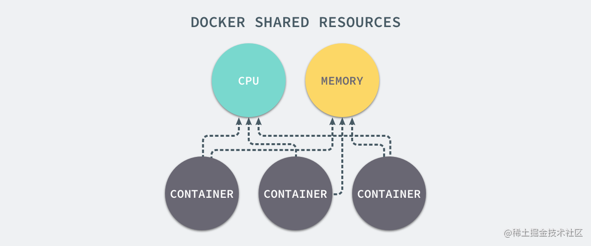
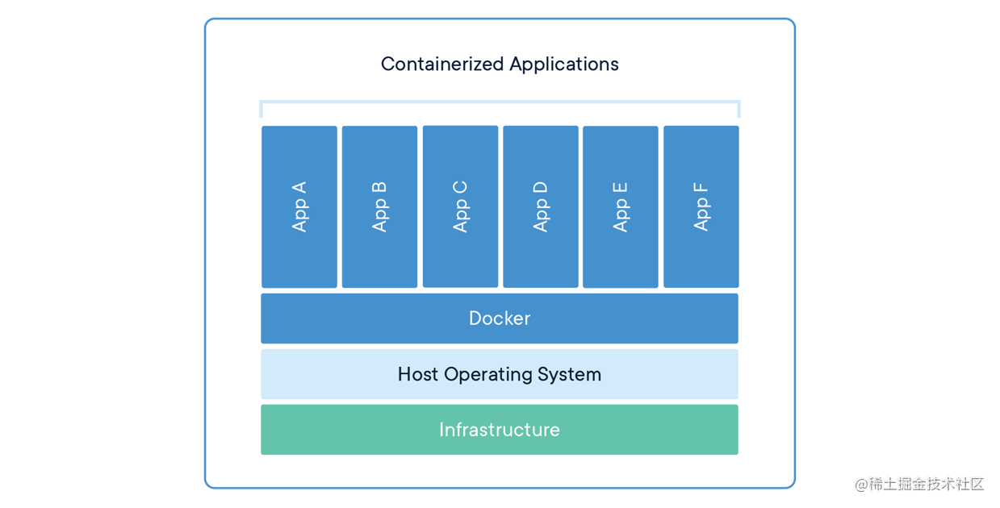
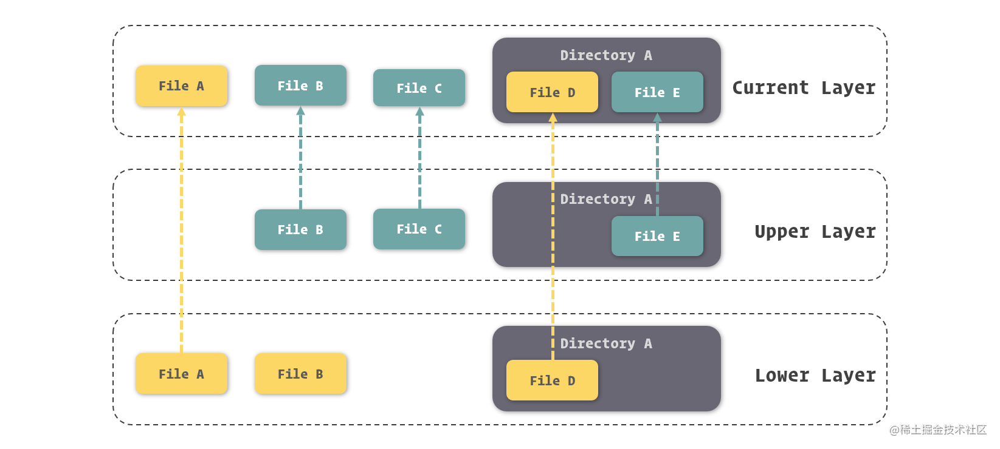

### [《开发者必备的 Docker 实践指南》](https://s.juejin.cn/ds/64XJAAn/)

### 1. Docker的技术实现
Docker 的实现，主要归结于三大技术：命名空间 ( Namespaces ) 、控制组 ( Control Groups ) 和联合文件系统 ( Union File System )

1. **Namespace**
通过Namespace可以创造出独立的进程运行空间，在这个空间中运行的进程完全感知不到外界系统中的其他进程，实现程序进程的隔离

2. **Control Groups**
主要做的是硬件资源的隔离和分配，通过CGroups我们可以指定任意一个环境对任意资源的占用率，对于很多分布式使用场景来说很有用


3. **Union File System**
Docker提供了对联合文件系统（Union File System）的改进，AUFS。它能将文件的更新挂载到老的文件之上，
而不去修改那些不更新的内容，这就意味着即使虚拟的文件系统被反复修改，也能保证对真实文件系统的空间占用保持一个较低水平。

Docker推崇轻量级容器的结构，即：一个应用一个容器，这样也方便跟踪不同应用的生命周期。当然我们可以在一个容器中运行多个程序，但是这虽然能体现我们动手能力很强，
但是这却违背了使用Docker来提升效率的初衷，如下为官方提供的容器架构图。


### 2. Docker的四大组成对象

1. **镜像 Image**
所谓镜像，可以理解为一个只读的文件包，其中包含了**虚拟环境运行最原始文件系统的内容**。Docker创新的利用了AUFS作为底层文件系统实现，
通过这种方式实现增量式的镜像结构，如下图。

每次对镜像内容的修改，Docker 都会将这些修改铸造成一个镜像层，而一个镜像其实就是由其下层所有的镜像层所组成的。
当然，每一个镜像层单独拿出来，与它之下的镜像层都可以组成一个镜像。也由于这种结构，Docker 的镜像实质上是无法被修改的，
因为所有对镜像的修改只会产生新的镜像，而不是更新原有的镜像。

2. **容器 Container**
容器是用来隔离虚拟环境的基础设施，而在 Docker 里，它也被引申为**隔离出来的虚拟环境**。如果把镜像理解为编程中的类，
那么容器就可以理解为类的实例。**镜像内存放的是不可变化的东西**，当以它们被基础的容器启动后，容器内也就成为了一个 **“活”** 的空间。
Docker容器内包含三项内容: 一个Docker镜像、一个程序运行环境和一个指令集合

3. **网络 Network**
在Docker中我们可以对每个容器的网络进行配置，还能在容器间建立虚拟网络，将数个容器包裹在其中，同时与其他网络环境隔离。
而且Docker还能在容器中营造独立的域名解析环境，这使得我们可以在不修改代码和配置的前提下迁移容器，Docker会为我们完成新环境的网络适配。
对此，我们能够将不同服务器上的两个Docker所提供的容器加入到同一个虚拟网络，形成完全屏蔽硬件的效果。

4. **数据卷 Volume**
Docker通过数据卷来实现文件的存放，**不仅仅保存在宿主操作系统中，还能够建立独立的目录持久存放数据在容器间共享**。

### 3. 镜像细则

镜像的命名我们可以分成三个部分: **username**、**repository** 和 **tag**

- username: 用于识别上传镜像的用户
- repository: 用于识别进行的内容，形成对镜像的描述，通常采用的是软件名
- tag: 用于表示镜像的版本。当我们在操作中没有具体给出镜像的 tag 时，Docker 会采用 **latest** 作为缺省 tag。
这带来了一项小便利，就是我们在不需要了解应用程序迭代周期的情况下，可以利用 latest 镜像保持**软件最新版本**的使用。

### 4. 容器网络
每个容器能够在宿主操作系统的网络环境中独立出来，形成自由的网络设备、IP协议栈、端口套接字、IP路由表和防火墙等，其中有三个比较核心的概念：
**沙盒、网络和端点**

1. 沙盒: 它的实现隔离了容器网络和宿主机网络，形成了完全独立的容器网络环境
2. 网络: Docker内部的虚拟子网，能够在容器间进行通讯
3. 端点: 是位于容器或网络隔离强上的洞，当容器的端点和网络的端点形成配对后，便能够进行数据传输了，像网络环境的出入口


### 操作命令

- 基本操作命令
  - docker version 
  - docker info
  - docker images: 查看镜像
  - docker pull: 从镜像仓库拉取镜像，拉取之后存放在本地接受当前这个Docker实例管理
  - docker search [镜像名称]: 我们可以得到关于这个名称的镜像的列表结果
  - docker inspect [镜像名称]: 查看镜像的详细信息
  - docker rmi [镜像名称/镜像ID]: 删除镜像，名称可以传多个，用空格隔开就好

- 启停操作命令
  - docker create --name [容器名称] [镜像名称]: 创建指定镜像的指定容器名的容器
  - docker start [容器名称]: 启动容器
  - docker run --name [容器名称] -d [镜像名称]: 将创建容器和启动容器合为一步，-d表示后台运行
  - docker ps -a: 列出容器中所有的容器，不加-a则只列出运行中的容器
  - docker stop [容器名称]: 停止容器
  - docker rm [容器名称]: 删除容器，-f强制删除选项
  - docker exec -it [容器名称] bash: 启动bash来对容器内的应用进行控制，-i表示保持我们的输入流，
  只有只用它才能保证控制台程序能够正确识别我们的命令，-t表示启用一个终端，让我们能看到bash的执行结果

- 网络互联
```
// 使用 --link 来连通两个容器
$ sudo docker run -d --name mysql -e MYSQL_RANDOM_ROOT_PASSWORD=yes mysql
$ sudo docker run -d --name webapp --link mysql webapp:latest

// 这个命令可以查看网络信息，默认加入docker创建的bridge网络
docker inspect mysql
...
"Networks": {
                "bridge": {
                    "IPAMConfig": null,
                    "Links": null,
                    "Aliases": null,
                    "NetworkID": "ad384a3fc10d3172c3e9e128da2520ac5b99cfbaaa3dfdcfd509564f7eb85ba6",
                    "EndpointID": "b93f73fd24dddc431922b6177ecbb9145cec3b906fd010dd7d3401834cee490a",
                    "Gateway": "172.17.0.1",
                    "IPAddress": "172.17.0.3",
                    "IPPrefixLen": 16,
                    "IPv6Gateway": "",
                    "GlobalIPv6Address": "",
                    "GlobalIPv6PrefixLen": 0,
                    "MacAddress": "02:42:ac:11:00:03",
                    "DriverOpts": null
                }
            }
...
```

- docker network create -d [网络驱动类型，bridge等] [网络名称]: 创建网络，-d是用来指定网络的驱动类型
- docker network ls: 查看已经存在的网络
- docker run -d --name mysql -e MYSQL_RANDOM_ROOT_PASSWORD=yes **--network** individual mysql:5.7: 启动容器并加入指定的网络
  （不同的网络的容器是不能相互连接和引用的）
- docker run -d --name nginx -p 80:80 -p 443:443 nginx:1.12: 端口映射，可以把容器的端口映射到宿主操作系统上，这样就能供外部访问
  端口映射的格式为`-p <ip>:<host-port>:<container-port>`，其中ip我们可以不填写，默认为0.0.0.0，监听所有网卡，
  之后是宿主机端口映射容器端口，这样就能在外部进行访问了

### 安装流程
```
$ sudo yum install yum-utils device-mapper-persistent-data lvm2
$
$ sudo yum-config-manager --add-repo https://download.docker.com/linux/centos/docker-ce.repo
$ sudo yum install docker-ce
$
$ sudo systemctl enable docker
$ sudo systemctl start docker
```

修改国内镜像仓库，编辑 `/etc/docker/daemon.json`
>{
"registry-mirrors": [
"https://registry.docker-cn.com"
]
}
> 

重启
> sudo systemctl daemon-reload 

> sudo systemctl restart docker