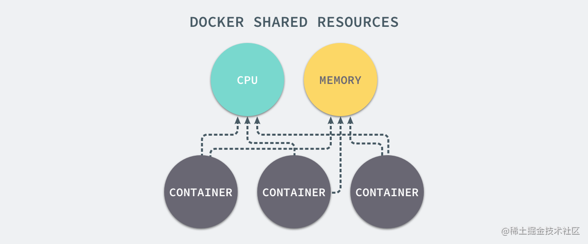
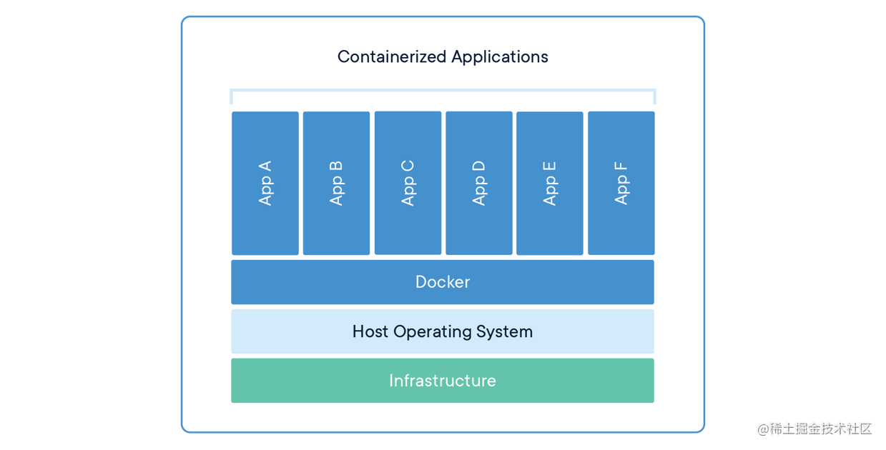
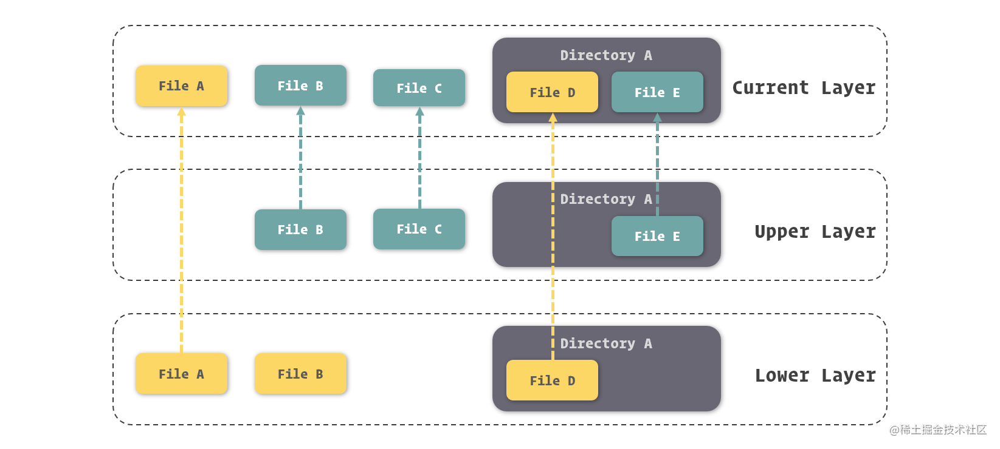
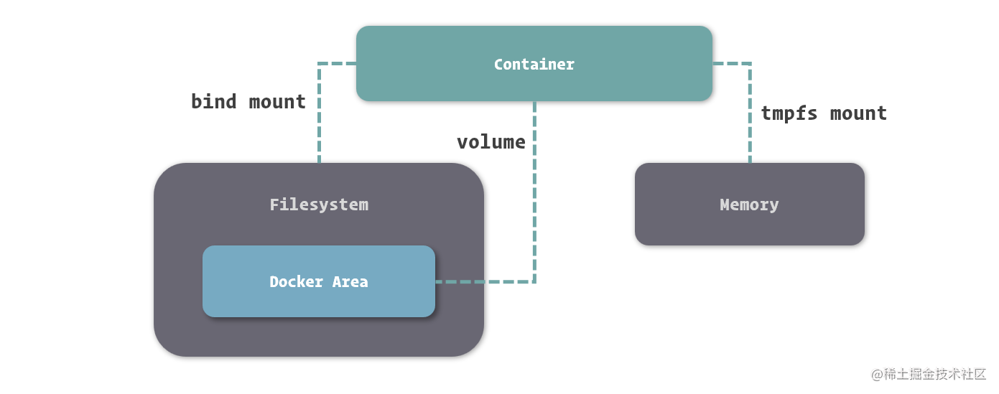
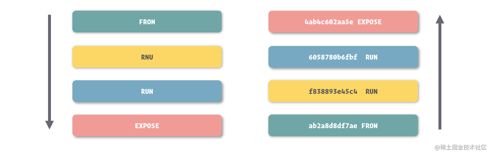

### [《开发者必备的 Docker 实践指南》](https://s.juejin.cn/ds/64XJAAn/)

### 1. Docker的技术实现
Docker 的实现，主要归结于三大技术：命名空间 ( Namespaces ) 、控制组 ( Control Groups ) 和联合文件系统 ( Union File System )

1. **Namespace**
通过Namespace可以创造出独立的进程运行空间，在这个空间中运行的进程完全感知不到外界系统中的其他进程，实现程序进程的隔离

2. **Control Groups**
主要做的是硬件资源的隔离和分配，通过CGroups我们可以指定任意一个环境对任意资源的占用率，对于很多分布式使用场景来说很有用


3. **Union File System**
Docker提供了对联合文件系统（Union File System）的改进，AUFS。它能将文件的更新挂载到老的文件之上，
而不去修改那些不更新的内容，这就意味着即使虚拟的文件系统被反复修改，也能保证对真实文件系统的空间占用保持一个较低水平。

Docker推崇轻量级容器的结构，即：一个应用一个容器，这样也方便跟踪不同应用的生命周期。当然我们可以在一个容器中运行多个程序，但是这虽然能体现我们动手能力很强，
但是这却违背了使用Docker来提升效率的初衷，如下为官方提供的容器架构图。


### 2. Docker的四大组成对象

1. **镜像 Image**
所谓镜像，可以理解为一个只读的文件包，其中包含了**虚拟环境运行最原始文件系统的内容**。Docker创新的利用了AUFS作为底层文件系统实现，
通过这种方式实现增量式的镜像结构，如下图。

每次对镜像内容的修改，Docker 都会将这些修改铸造成一个镜像层，而一个镜像其实就是由其下层所有的镜像层所组成的。
当然，每一个镜像层单独拿出来，与它之下的镜像层都可以组成一个镜像。也由于这种结构，Docker 的镜像实质上是无法被修改的，
因为所有对镜像的修改只会产生新的镜像，而不是更新原有的镜像。

2. **容器 Container**
容器是用来隔离虚拟环境的基础设施，而在 Docker 里，它也被引申为**隔离出来的虚拟环境**。如果把镜像理解为编程中的类，
那么容器就可以理解为类的实例。**镜像内存放的是不可变化的东西**，当以它们被基础的容器启动后，容器内也就成为了一个 **“活”** 的空间。
Docker容器内包含三项内容: 一个Docker镜像、一个程序运行环境和一个指令集合

3. **网络 Network**
在Docker中我们可以对每个容器的网络进行配置，还能在容器间建立虚拟网络，将数个容器包裹在其中，同时与其他网络环境隔离。
而且Docker还能在容器中营造独立的域名解析环境，这使得我们可以在不修改代码和配置的前提下迁移容器，Docker会为我们完成新环境的网络适配。
对此，我们能够将不同服务器上的两个Docker所提供的容器加入到同一个虚拟网络，形成完全屏蔽硬件的效果。

4. **数据卷 Volume**
Docker通过数据卷来实现文件的存放，**不仅仅保存在宿主操作系统中，还能够建立独立的目录持久存放数据在容器间共享**。

### 3. 镜像细则

镜像的命名我们可以分成三个部分: **username**、**repository** 和 **tag**

- username: 用于识别上传镜像的用户
- repository: 用于识别进行的内容，形成对镜像的描述，通常采用的是软件名
- tag: 用于表示镜像的版本。当我们在操作中没有具体给出镜像的 tag 时，Docker 会采用 **latest** 作为缺省 tag。
这带来了一项小便利，就是我们在不需要了解应用程序迭代周期的情况下，可以利用 latest 镜像保持**软件最新版本**的使用。

### 4. 容器网络
每个容器能够在宿主操作系统的网络环境中独立出来，形成自由的网络设备、IP协议栈、端口套接字、IP路由表和防火墙等，其中有三个比较核心的概念：
**沙盒、网络和端点**

1. 沙盒: 它的实现隔离了容器网络和宿主机网络，形成了完全独立的容器网络环境
2. 网络: Docker内部的虚拟子网，能够在容器间进行通讯
3. 端点: 是位于容器或网络隔离强上的洞，当容器的端点和网络的端点形成配对后，便能够进行数据传输了，像网络环境的出入口

### 5. Docker的数据管理
为了解决容器生命周期和数据生命周期一致和容器外部难以操作容器内部文件的问题，Docker提供了三种挂载方式：


- **Bind Mount**: 能够直接将宿主操作系统中的目录和文件挂载到容器内的文件系统中，通过指定容器外的路径和容器内的路径，
  就可以形成挂载映射关系，在容器内外对文件的读写，都是相互可见的
- **Volume**: 从宿主操作系统中挂载目录到容器内，只不过这个挂载的目录由 Docker 进行管理，我们只需要指定容器内的目录，
  不需要关心具体挂载到了宿主操作系统中的哪里
- **Tmpfs Mount**: 支持挂载系统内存中的一部分到容器的文件系统里，不过由于内存和容器的特征，它的存储并不是持久的，
  其中的内容会随着容器的停止而消失

其中Bind Mount和Volume两种绑定方式都是通过-v参数来指定的，不过Volume挂载方式不需要传宿主机的绝对路径，由Docker统一管理

### 6. 操作镜像

容器内所有的修改我们可以通过"提交"命令保存成新的镜像，之后我们可以使用save命令将镜像输出成tar文件，
之后这个文件复制到其他服务器上的时候，我们可以通过load命令来导入成为新服务器上的镜像。

当然也可以直接把容器导出，然后在导入成为镜像。

### 7. Dockerfile

- Dockerfile就很像环境搭建手册，其中包含的是一个容器构建的过程

#### 7.1 FROM

FROM命令用来指定基础镜像，接下来所有的指令都是基于这个镜像展开，Dockerfile的第一条指令必须是FROM

```dockerfile
FROM <image> [AS <name>]
FROM <image>[:<tag>] [AS <name>]
FROM <image>[@<digest>] [AS <name>]
```

#### 7.2 RUN
RUN命令后边直接拼接要执行的命令，在构建时，Docker会执行这些命令，并将它们对文件系统的修改记录下来，形成镜像的变化

```dockerfile
RUN <command>
RUN ["executable", "param1", "param2"]
```

RUN命令支持使用反斜线`\`来实现命令换行，方便阅读

#### 7.3 ENTRYPOINT 和 CMD
通过ENTRYPOINT 和 CMD命令在容器启动时来启动容器中进程号为1的进程

```dockerfile
ENTRYPOINT ["executable", "param1", "param2"]
ENTRYPOINT command param1 param2

CMD ["executable","param1","param2"]
CMD ["param1","param2"]
CMD command param1 param2
```
#### 7.4 EXPOSE
通过 EXPOSE 指令就可以为镜像指定要暴露的端口

```dockerfile
EXPOSE <port> [<port>/<protocol>...]
```

#### 7.5 VOLUME
VOLUME 指令来定义基于此镜像的容器自动建立的数据卷，不需要我们再单独使用`-v`来配置
```dockerfile
VOLUME ["/data"]
```

#### 7.6 COPY 和 ADD
使用 COPY 或 ADD 指令能够从宿主机的文件系统里拷贝内容到镜像里的文件系统中

```dockerfile
COPY [--chown=<user>:<group>] <src>... <dest>
ADD [--chown=<user>:<group>] <src>... <dest>

COPY [--chown=<user>:<group>] ["<src>",... "<dest>"]
ADD [--chown=<user>:<group>] ["<src>",... "<dest>"]
```

COPY 与 ADD 指令的定义方式完全一样，需要注意的仅是当我们的目录中存在空格时，可以使用后两种格式避免空格产生歧义。

但是ADD支持使用URL地址作为src源，并且在源文件被识别为压缩包时，自动进行解压，但是COPY没有这个能力

#### 7.7 构建镜像

编写好Dockerfile，就可以构建镜像了

```
docker build -t [生成的镜像名] -f ./webapp/a.Dockerfile ./webapp
```
其中这个参数为一个目录路径而并非是Dockerfile的文件路径，**默认情况下会在这个目录下寻找Dockerfile文件**，另外如果Dockerfile文件
不在这个目录下，我们可以根据`可选的配置-f`来指定Dockerfile文件的位置，其中`-t`为指定新生成的镜像名

### 8. Dockerfile的常见用法

#### 8.1 ARG
用ARG指令来定义参数变量，在后文中用`$参数名`的形式来占位

```dockerfile
FROM debian:stretch-slim

## ......

ARG TOMCAT_MAJOR
ARG TOMCAT_VERSION

## ......

RUN wget -O tomcat.tar.gz "https://www.apache.org/dyn/closer.cgi?action=download&filename=tomcat/tomcat-$TOMCAT_MAJOR/v$TOMCAT_VERSION/bin/apache-tomcat-$TOMCAT_VERSION.tar.gz"
```
构建时需要传入参数的值

```shell
docker build --build-arg TOMCAT_MAJOR=8 --build-arg TOMCAT_VERSION=8.0.53 -t tomcat:8.0 ./tomcat
```

#### 8.2 ENV
环境变量与ARG参数变量类似，不过环境变量是直接赋值，同样也是`$参数名`来占位取值
```dockerfile
FROM debian:stretch-slim

## ......

ENV TOMCAT_MAJOR 8
ENV TOMCAT_VERSION 8.0.53

...
```
在运行容器时我们也可以指定`-e`或`-env`选项来对环境变量进行修改或者添加新的环境变量。

我们可以发现参数和环境变量都是采用`$参数名`来占位取值的，但是环境变量会永远覆盖ARG所定义的变量。

#### 8.3 合并命令
```dockerfile
RUN apt-get update; \
    apt-get install -y --no-install-recommends $fetchDeps; \
    rm -rf /var/lib/apt/lists/*;
    
RUN apt-get update
RUN apt-get install -y --no-install-recommends $fetchDeps
RUN rm -rf /var/lib/apt/lists/*
```
为什么常见的是第一种写法呢？因为在镜像构建的过程中，Docker会在每一条能够对系统进行改动的命令执行前，先基于上条命令的结果启动一个容器，
在容器中运行完这条指令之后，将结果打包成一个镜像层，如此反复，最终形成镜像，所以镜像是由多个镜像层叠加而来的，而每一层对应着Dockerfile中的命令。

这样我们在把多条命令合并到一条中执行后，这样就减少了镜像层的数量，也减少了镜像构建过程中反复创建容器的次数，提高了镜像构建的速度。



### 9. 去Docker Hub拉取镜像，自己把它跑起来

- 打开[Docker Hub](https://hub.docker.com/search?q=)
- 搜索Mysql，进入页面后查看Tags，选择自己想要的镜像，然后把它拉(pull)下来
- 在页面上还介绍了很多参数，避免了我们繁杂的配置，比如执行下边这条命令把它运行起来
```shell
## 后台运行mysql 指定root账号的密码为1234567 主机端口3307映射容器端口3306 外部访问3307即可，这样就非常快了
 docker run -d --name mysql -e MYSQL_ROOT_PASSWORD=1234567 -p 3307:3306 mysql:5.7.39
```

### 10. Docker Compose
Docker Compose 配置文件里可以包含许多内容，从每个容器的各个细节控制，到网络、数据卷等的定义，避免了繁琐的单一容器配置，改成了统一配置

---
### 操作命令

#### 1. 基本操作命令
  - docker version 
  - docker info
  - docker images: 查看镜像
  - docker pull: 从镜像仓库拉取镜像，拉取之后存放在本地接受当前这个Docker实例管理
  - docker search [镜像名称]: 我们可以得到关于这个名称的镜像的列表结果
  - docker inspect [镜像名称]: 查看镜像的详细信息
  - docker rmi [镜像名称/镜像ID]: 删除镜像，名称可以传多个，用空格隔开就好

#### 2. 启停操作命令
  - docker create --name [容器名称] [镜像名称]: 创建指定镜像的指定容器名的容器
  - docker start [容器名称]: 启动容器
  - docker run --name [容器名称] -d [镜像名称]: 将创建容器和启动容器合为一步，-d表示后台运行
  - docker ps -a: 列出容器中所有的容器，不加-a则只列出运行中的容器
  - docker stop [容器名称]: 停止容器
  - docker rm [容器名称]: 删除容器，-f强制删除选项
  - docker exec -it [容器名称] bash: 启动bash来对容器内的应用进行控制，-i表示保持我们的输入流，
  只有只用它才能保证控制台程序能够正确识别我们的命令，-t表示启用一个终端，让我们能看到bash的执行结果

#### 3. 网络互联
```
// 使用 --link 来连通两个容器
$ sudo docker run -d --name mysql -e MYSQL_RANDOM_ROOT_PASSWORD=yes mysql
$ sudo docker run -d --name webapp --link mysql webapp:latest

// 这个命令可以查看网络信息，默认加入docker创建的bridge网络
docker inspect mysql
...
"Networks": {
                "bridge": {
                    "IPAMConfig": null,
                    "Links": null,
                    "Aliases": null,
                    "NetworkID": "ad384a3fc10d3172c3e9e128da2520ac5b99cfbaaa3dfdcfd509564f7eb85ba6",
                    "EndpointID": "b93f73fd24dddc431922b6177ecbb9145cec3b906fd010dd7d3401834cee490a",
                    "Gateway": "172.17.0.1",
                    "IPAddress": "172.17.0.3",
                    "IPPrefixLen": 16,
                    "IPv6Gateway": "",
                    "GlobalIPv6Address": "",
                    "GlobalIPv6PrefixLen": 0,
                    "MacAddress": "02:42:ac:11:00:03",
                    "DriverOpts": null
                }
            }
...
```

- docker network create -d [网络驱动类型，bridge等] [网络名称]: 创建网络，-d是用来指定网络的驱动类型
- docker network ls: 查看已经存在的网络
- docker run -d --name mysql -e MYSQL_RANDOM_ROOT_PASSWORD=yes **--network** individual mysql:5.7: 启动容器并加入指定的网络
  （不同的网络的容器是不能相互连接和引用的）
- docker run -d --name nginx -p 80:80 -p 443:443 nginx:1.12: 端口映射，可以把容器的端口映射到宿主操作系统上，这样就能供外部访问
  端口映射的格式为`-p <ip>:<host-port>:<container-port>`，其中ip我们可以不填写，默认为0.0.0.0，监听所有网卡，
  之后是宿主机端口映射容器端口，这样就能在外部进行访问了

#### 4. 文件挂载
- docker run -d --name nginx **-v** /webapp/html:/usr/share/nginx/html nginx:1.12: 
  使用 **-v** 或 **--volume** 来挂载宿主操作系统目录的形式是 `-v <host-path>:<container-path>` 
  或 `--volume <host-path>:<container-path>`，其中host-path代表宿主机目录，container-path代表容器目录，
  `docker run -d --name nginx -v /webapp/html:/usr/share/nginx/html:ro nginx:1.12`加上了:ro表示只读

- docker run -d --name webapp **--tmpfs** /webapp/cache webapp:latest: 临时内存挂载，通过tmpfs来完成，
  我们只需要写好容器内的目录就好了

- docker run -d --name webapp -v /webapp/storage webapp:latest: **数据卷挂载**，无需指定宿主机的目录，指定容器内的目录即可
- docker run -d --name webapp -v appdata:/webapp/storage webapp:latest: 为数据卷命名`-v <name>:<container-path>`，

共用数据卷，指定相同的数据卷名称
- docker run -d --name webapp -v **html:**/webapp/html webapp:latest
- docker run -d --name nginx -v **html:**/usr/share/nginx/html:ro nginx:1.12

- docker volume create: 创建数据卷
- docker volume ls: 列出已创建的数据卷
- docker volume rm [数据卷名]: 删除数据卷
- docker rm -v [容器名称]: 删除容器添加-v参数，来一同删除数据卷，因为不删除这个数据卷它也不能被复用
- docker volume prune: 删除没用的数据卷

#### 5. 操作容器

- docker commit -m "remark" [镜像名称]: 提交容器的修改，提交之后我们会得到新的镜像ID，并且能在images命令下查看到，其中-m为可选提交备注
- docker tag [镜像ID 或 老镜像名] [新的镜像名儿]: 可以使用tag能够为没有名字的镜像起名或者为镜像添加一个新的名字
- docker commit -m "remark" webapp webapp：2.0: 把以上两条命令合成为1条命令，提交镜像并取一个新的名字
- docker save [镜像名] > [镜像名].tar: 输出镜像
- docker save -o ./[文件名].tar [镜像名 镜像名...]: 可以输出多个镜像到一个文件里，多个镜像名用空格隔开
- docker load -i [文件名]: 导入文件成为镜像
- docker export -o ./[文件名].tar [容器名]: 导出容器
- docker import ./[文件名].tar [镜像名]: 这里导入的不是容器，是镜像，虽然是指定的容器的包，但是导入之后还是镜像

#### 6. Docker Compose

- docker-compose -f ./compose/docker-compose.yml -p myapp up -d: 启动，-f指定配置文件位置，
  不指定时会在当前目录下搜索`docker-compose.yml` 文件，-p指定项目名，-d后台运行

- docker-compose down: 停止所有容器
- docker-compose logs [容器名字]: 查看日志

### 7. Docker 启动过的容器服务

需要挂载自定义配置文件的去 `conf` 查看、获取对应的配置文件

- Redis

```shell
# 创建对应的本地目录/usr/dream/redis/*
docker run --name redis 
            -p 6379:6379 
            -v /usr/dream/redis/conf/redis.conf:/etc/redis/redis.conf  
            -v /usr/dream/redis/data:/data 
            -d redis:6.2.12 redis-server /etc/redis/redis.conf
```

- Seata
```shell
# -e SEATA_IP 指定IP供外部连接 -v 挂载服务器配置文件目录到容器目录
docker run --name seata-server -d \
        -p 8091:8091 \
        -e SEATA_CONFIG_NAME=file:/root/seata-config/registry \
        -e SEATA_IP=xxx.xx.xx.xxx \
        -v /root/seata-config:/root/seata-config  \
        seataio/seata-server:1.4.2
```
- Nacos
```shell
docker pull nacos/nacos-server
mkdir -p /usr/dream/nacos/logs/
mkdir -p /usr/dream/nacos/init.d/
mkdir -p /usr/dream/nacos/data/

docker run 
--name nacos -d 
-p 8848:8848 
-p 9848:9848 
-p 9849:9849 
--privileged=true 
--restart=always 
-e JVM_XMS=256m 
-e JVM_XMX=256m 
-e MODE=standalone 
-e PREFER_HOST_MODE=ip
-e NACOS_SERVER_IP=xxx
-e NACOS_APPLICATION_PORT=8848
-e SPRING_DATASOURCE_PLATFORM=mysql 
-e MYSQL_SERVICE_HOST=xxx
-e MYSQL_SERVICE_PORT=3306 
-e MYSQL_SERVICE_DB_NAME=nacos_config
-e MYSQL_SERVICE_USER=root 
-e MYSQL_SERVICE_PASSWORD=root
# 挂载服务器目录到容器内
-v /usr/dream/nacos/nacos/logs:/home/nacos/logs 
-v /usr/dream/nacos/init.d/custom.properties:/etc/nacos/init.d/custom.properties 
-v /usr/dream/nacos/data:/home/nacos/data 
nacos/nacos-server
```

- zookeeper
```shell
# the zookeeper client port, follower port, election port, AdminServer port respectively
docker run --name zookeeper -p 2181:2181 -p 2888:2888 -p 3888:3888 -p 8080:8080  --restart always -d zookeeper

# 进入容器命令行
docker exec -it zookeeper bash
./bin/zkCli.sh
```
- zookeeper 集群

`zookeeper-compose.yml`文件
```yaml
version: '3.1'

services:
  zoo1:
    image: zookeeper:latest
    restart: always
    hostname: zoo1
    networks:
      - zookeeper
    ports:
      - 2181:2181
    environment:
      ZOO_MY_ID: 1
      ZOO_SERVERS: server.1=zoo1:2888:3888;2181 server.2=zoo2:2888:3888;2181 server.3=zoo3:2888:3888;2181

  zoo2:
    image: zookeeper:latest
    restart: always
    hostname: zoo2
    networks:
      - zookeeper
    ports:
      - 2182:2181
    environment:
      ZOO_MY_ID: 2
      ZOO_SERVERS: server.1=zoo1:2888:3888;2181 server.2=zoo2:2888:3888;2181 server.3=zoo3:2888:3888;2181

  zoo3:
    image: zookeeper:latest
    restart: always
    hostname: zoo3
    networks:
      - zookeeper
    ports:
      - 2183:2181
    environment:
      ZOO_MY_ID: 3
      ZOO_SERVERS: server.1=zoo1:2888:3888;2181 server.2=zoo2:2888:3888;2181 server.3=zoo3:2888:3888;2181

networks:
  zookeeper:
    external: true
```
执行命令
```shell
# 创建网络
docker network create zookeeper
# 
docker-compose -f zookeeper-compose.yml -p zookeeper up -d
```

- Zipkin
```shell
docker run --name zipkin -d -p 9411:9411 openzipkin/zipkin
```
---

### 安装流程
```
$ sudo yum install yum-utils device-mapper-persistent-data lvm2
$
$ sudo yum-config-manager --add-repo https://download.docker.com/linux/centos/docker-ce.repo
$ sudo yum install docker-ce
$
$ sudo systemctl enable docker
$ sudo systemctl start docker
```

修改国内镜像仓库，编辑 `/etc/docker/daemon.json`
>{
"registry-mirrors": [
"https://registry.docker-cn.com"
]
}
> 

重启
> sudo systemctl daemon-reload 

> sudo systemctl restart docker

---

### 安装Docker Compose

```shell
curl -L "https://github.com/docker/compose/releases/download/1.22.0/docker-compose-$(uname -s)-$(uname -m)" -o /usr/local/bin/docker-compose

chmod +x /usr/local/bin/docker-compose

docker-compose version
```

- `docker-compose.yml` 配置文件

```yaml
version: "3"

services:

  redis:
    image: redis:3.2
    networks:
      - backend
    volumes:
      - ./redis/redis.conf:/etc/redis.conf:ro
    ports:
      - "6379:6379"
    command: ["redis-server", "/etc/redis.conf"]

  database:
    image: mysql:5.7
    networks:
      - backend
    volumes:
      - ./mysql/my.cnf:/etc/mysql/my.cnf:ro
      - mysql-data:/var/lib/mysql
    environment:
      - MYSQL_ROOT_PASSWORD=my-secret-pw
    ports:
      - "3306:3306"

  webapp:
    build: ./webapp
    networks:
      - frontend
      - backend
    volumes:
      - ./webapp:/webapp
    depends_on:
      - redis
      - database

  nginx:
    image: nginx:1.12
    networks:
      - frontend
    volumes:
      - ./nginx/nginx.conf:/etc/nginx/nginx.conf:ro
      - ./nginx/conf.d:/etc/nginx/conf.d:ro
      - ./webapp/html:/webapp/html
    depends_on:
      - webapp
    ports:
      - "80:80"
      - "443:443"

networks:
  frontend:
  backend:

volumes:
  mysql-data:
```
Docker Compose 为我们启动项目的时候，会检查所有依赖，depends_on 这个配置项，形成正确的启动顺序并按这个顺序来依次启动容器
